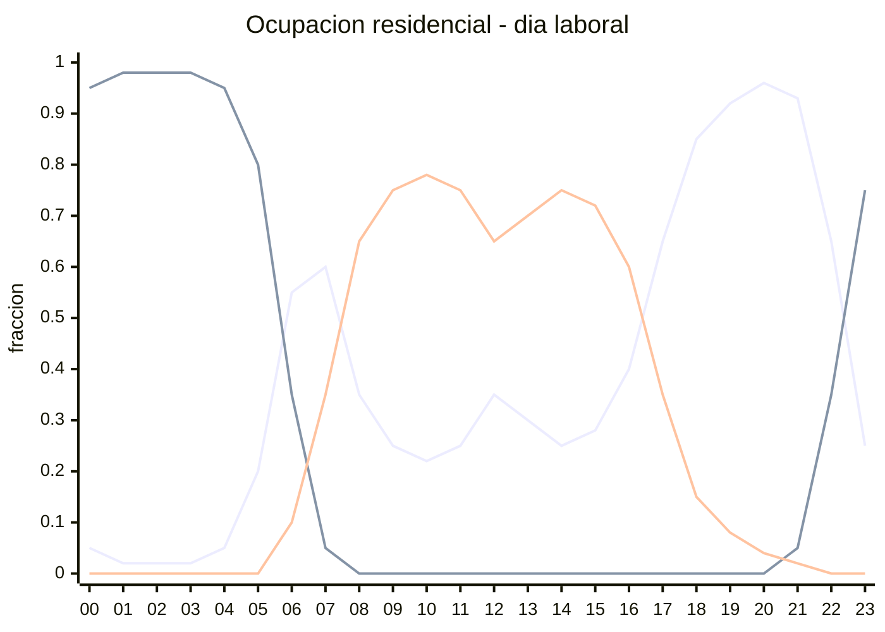
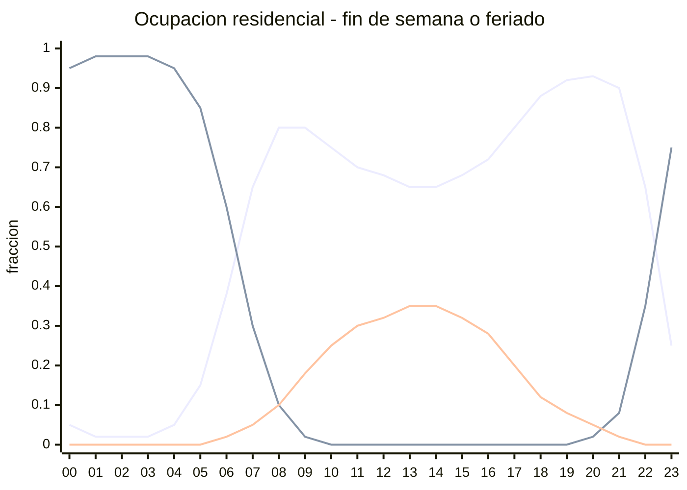
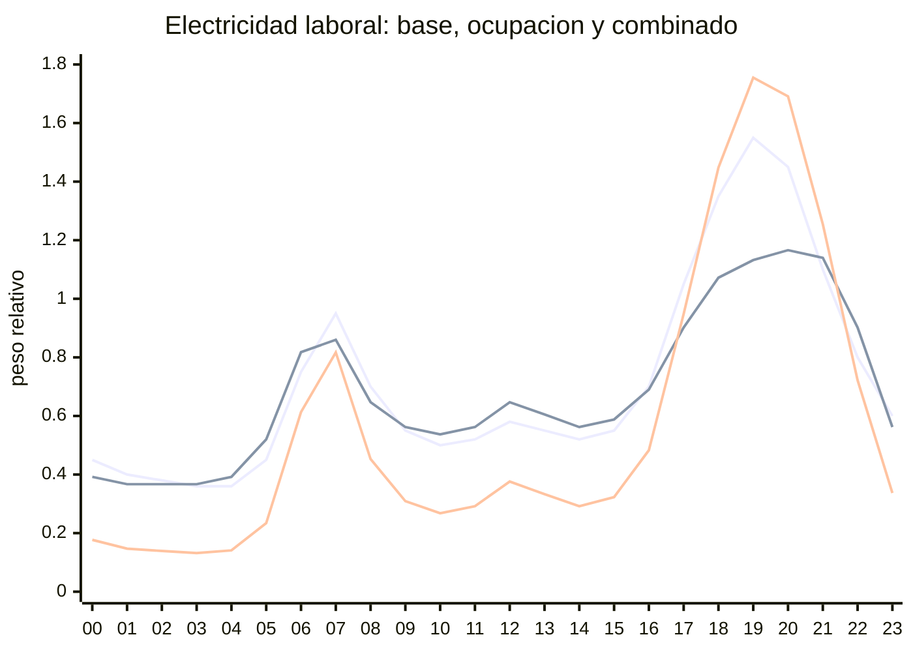
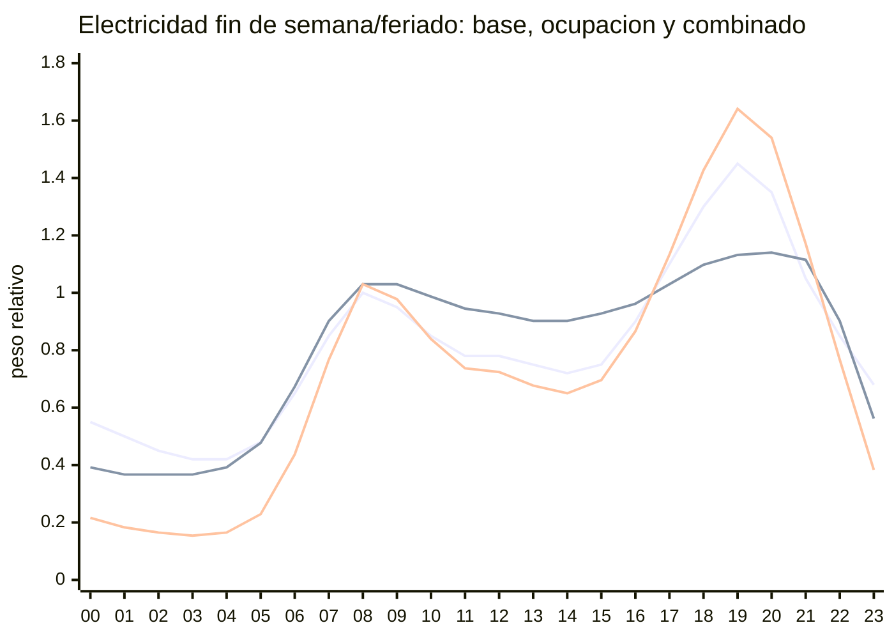
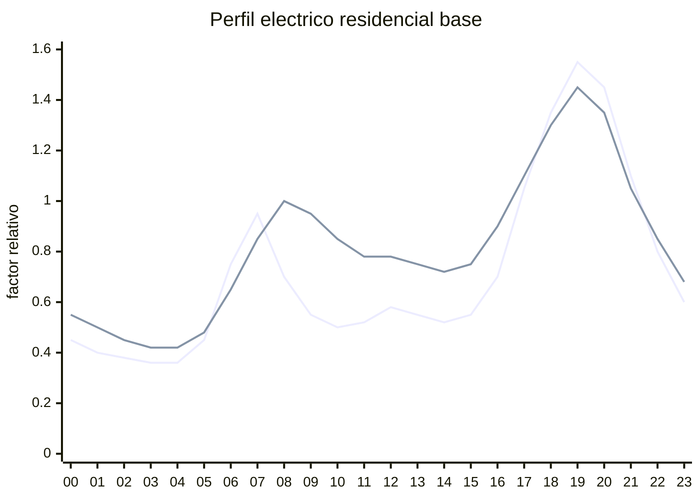
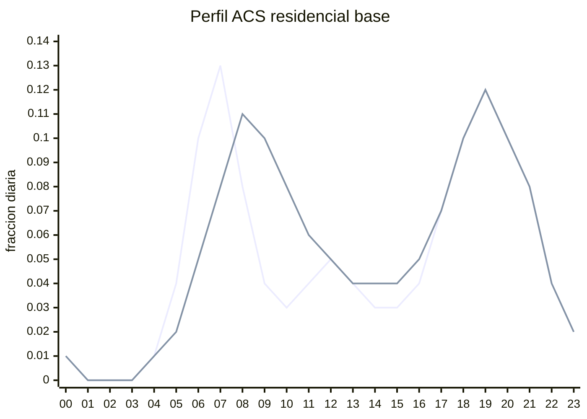

# Perfiles horarios base para tsib_fcr

Esta guia documenta los perfiles horarios base que usa `scripts/simular_edificios_tsib_fcr.py` para electricidad residencial, ACS y ganancias internas al preparar la configuracion de `tsib_fcr`.

Importante: las curvas actuales son perfiles sinteticos simplificados para prototipado. Estan basadas en patrones residenciales reportados en literatura y normas de perfiles de referencia, pero no son aun perfiles calibrados con mediciones chilenas. Por eso deben tratarse como supuestos transparentes y reemplazables.

## Resumen operativo

| Componente | Estado actual | Unidad interna | Escalamiento |
|---|---|---:|---|
| Ganancias internas | Perfil horario acoplado a ocupacion y electricidad | kW termicos sensibles | personas activas/durmiendo + 15% de electricidad de artefactos |
| Electricidad base | Perfil horario residencial | kWh por hora por vivienda | `2500 kWh/vivienda-ano` |
| ACS | Perfil horario residencial | kWh termicos utiles por hora por vivienda | `40 L/persona-dia`, `T_ACS = 55 C`, `DeltaT(t) = T_ACS - T_mains(t)` |
| Refrigeracion | Resultado del modelo 5R1C | kWh termicos de frio | Se convierte a electricidad con `COP = 3.0` |
| Ocupacion | Perfil horario residencial | fraccion 0-1 | `occ_active + occ_sleeping + occ_nothome = 1` |

La electricidad base no incluye refrigeracion. La refrigeracion sale de `tsib_fcr` como demanda termica y el script calcula una electricidad equivalente:

```text
refrigeracion_electrica_kwh = refrigeracion_anual_kwh / cooling_cop
electricidad_total_con_refrigeracion_kwh = electricidad_anual_kwh + refrigeracion_electrica_kwh
```

## Base tecnica y alcance

Los perfiles actuales no fueron copiados de una base normativa especifica. Son una aproximacion operacional con forma diaria residencial:

- Electricidad: carga baja de madrugada, aumento matinal, valle relativo en horas laborales y peak vespertino/nocturno.
- ACS: peak de duchas/uso sanitario en la manana, demanda menor durante el dia y segundo peak en la tarde/noche.
- Feriados: se tratan como dias de fin de semana, criterio comun en herramientas de perfiles residenciales.

Este criterio es consistente con la literatura tecnica, pero no reemplaza una calibracion local. Las referencias utiles para respaldar la estructura metodologica son:

| Referencia | Que respalda | Uso en MERLIN_RCP |
|---|---|---|
| Richardson et al. (2010), `Domestic electricity use: a high-resolution energy demand model`, Energy and Buildings. DOI: https://doi.org/10.1016/j.enbuild.2010.05.023 | La electricidad residencial depende de ocupacion activa y actividades domesticas, con fuerte variabilidad horaria. | Justifica usar perfiles horarios residenciales diferenciados por tipo de dia, no una tasa constante. |
| Fischer et al. (2016), `A stochastic bottom-up model for space heating and domestic hot water load profiles for German households`, Energy and Buildings. DOI: https://doi.org/10.1016/j.enbuild.2016.04.069 | Modelacion conjunta de electricidad, ACS y calefaccion desde comportamiento residencial; ACS con extracciones horarias. | Justifica separar ACS de calefaccion de recinto y modelarla como perfil horario por persona/hogar. |
| VDI 4655, `Reference load profiles of residential buildings for power, heat and domestic hot water...` | Uso de perfiles de referencia para electricidad, calor y ACS en viviendas. | Justifica el enfoque de perfiles tipicos para simulacion y comparacion cuando no hay medicion local. |
| demandlib, implementacion de perfiles VDI 4655. https://demandlib.readthedocs.io/en/latest/reference/index.html | Generacion de series anuales normalizadas a demandas anuales para calefaccion, ACS y electricidad. | Respalda normalizar la forma horaria al consumo anual objetivo. |
| nPro, perfiles normalizados ACS residenciales. https://www.npro.energy/main/en/load-profiles/residential/load-profile-residential-domestic-hot-water | Perfiles ACS horarios normalizados y feriados modelados como domingos. | Respalda tratar feriados como fin de semana para perfiles de ACS/electricidad. |

La consecuencia practica es que los resultados actuales son adecuados para pruebas de integracion y sensibilidad, pero no deberian presentarse como demanda final calibrada sin contrastarlos con mediciones locales de electricidad, gas/ACS o encuestas de uso horario.

## Ocupacion y control de confort

El script usa tres perfiles horarios de ocupacion:

| Perfil | Significado | Rango |
|---|---|---:|
| `occ_active` | Fraccion de personas/viviendas presentes y activas. | 0 a 1 |
| `occ_sleeping` | Fraccion presente, pero durmiendo o no activa. | 0 a 1 |
| `occ_nothome` | Fraccion fuera de la vivienda. | 0 a 1 |

En cada hora:

```text
occ_active + occ_sleeping + occ_nothome = 1
```

Un valor intermedio no significa que una persona individual este "medio fuera"; representa una fraccion agregada de viviendas/personas en ese estado. Por ejemplo, `occ_nothome = 0.70` significa que el arquetipo promedio se trata como 70% fuera y 30% presente.

Estos perfiles afectan tres partes del calculo:

1. Electricidad base: la forma horaria electrica se pondera por presencia activa y luego se normaliza a la energia anual objetivo.
2. Ganancias internas: se calculan desde conteos enteros de personas activas/durmiendo mas 15% de la electricidad de artefactos.
3. Setpoints horarios: se interpolan entre activos y durmiendo cuando hay personas presentes; si no queda nadie presente, HVAC queda apagado.

Los setpoints actuales son:

| Estado | Calefaccion | Refrigeracion |
|---|---:|---:|
| Activo/presente | 21 C | 24 C |
| Durmiendo | 18 C | 24 C |
| Fuera | -20 C | 60 C |

El estado `Fuera` representa HVAC apagado. No se usan infinitos reales porque el modelo 5R1C directo resuelve balances algebraicos hora a hora y los infinitos pueden generar `NaN` o inestabilidad numerica. En su lugar se usan cotas finitas extremas:

```text
calefaccion apagada: -20 C
refrigeracion apagada: 60 C
```

Aunque los perfiles `occ_active`, `occ_sleeping` y `occ_nothome` son fraccionales, el control termico primero los convierte a conteos enteros de personas por vivienda. La conversion usa el metodo de restos mayores para que en cada hora se cumpla:

```text
active_persons_h + sleeping_persons_h + nothome_persons_h = personas_por_vivienda
```

Luego:

- si `active_persons_h + sleeping_persons_h = 0`, se interpreta que no hay nadie en casa y se usa HVAC apagado con -20 C / 60 C;
- en esas mismas horas sin personas presentes, la demanda ACS se fuerza a cero;
- si hay personas presentes, la calefaccion se interpola solo entre activos y durmiendo;
- la refrigeracion usa 24 C cuando hay al menos una persona presente.

La interpolacion de calefaccion con personas presentes es:

```text
setpoint_calefaccion_h =
    (active_persons_h * 21 + sleeping_persons_h * 18)
    / (active_persons_h + sleeping_persons_h)
```

Esto mantiene la mezcla activo/durmiendo cuando corresponde, pero evita que los setpoints de apagado entren en una interpolacion lineal. Por ejemplo, si una vivienda de 3 personas queda aproximada como `active=0`, `sleeping=0`, `nothome=3`, no hay demanda de confort. En cambio, si queda `active=1`, `sleeping=1`, `nothome=1`, si hay personas presentes y el setpoint de calefaccion es 19,5 C.

### Respaldo del perfil de ocupacion

El perfil numerico usado por MERLIN_RCP es sintetico. No fue estimado desde una encuesta chilena ni desde mediciones smart meter. Se construyo para representar una vivienda residencial promedio con:

- alta fraccion durmiendo durante madrugada;
- salida progresiva en la manana laboral;
- valle de ocupacion activa en horario laboral;
- retorno parcial al mediodia;
- peak de ocupacion activa tarde/noche;
- mayor permanencia en casa durante fines de semana y feriados.

La estructura se apoya en estas referencias metodologicas:

| Referencia | Que respalda | Relacion con el perfil actual |
|---|---|---|
| Richardson, Thomson & Infield (2008), `A high-resolution domestic building occupancy model for energy demand simulations`, Energy and Buildings. DOI: https://doi.org/10.1016/j.enbuild.2008.02.006 | Modelar ocupacion activa en viviendas como insumo principal para demanda energetica residencial. Define ocupante activo como presente y despierto. | Justifica separar `occ_active` de `occ_sleeping` y usar ocupacion activa para modular electricidad. |
| Richardson et al. (2010), `Domestic electricity use: a high-resolution energy demand model`, Energy and Buildings. DOI: https://doi.org/10.1016/j.enbuild.2010.05.023 | La electricidad domestica de alta resolucion se modela a partir de ocupacion activa y uso de artefactos. | Justifica que `elecLoad` dependa de `occ_active`, aunque luego se normalice al consumo anual. |
| Fischer et al. (2016), `A stochastic bottom-up model for space heating and domestic hot water load profiles for German households`, Energy and Buildings. DOI: https://doi.org/10.1016/j.enbuild.2016.04.069 | Los modelos bottom-up pueden acoplar electricidad, ACS y calefaccion con comportamiento residencial. | Justifica usar una misma representacion de ocupacion para electricidad, ACS, ganancias internas y setpoints. |
| Lopez-Rodriguez et al. (2013), `Analysis and modeling of active occupancy of the residential sector in Spain`, Applied Energy. DOI: https://doi.org/10.1016/j.apenergy.2013.05.067 | Encuestas de uso de tiempo muestran patrones diarios de ocupacion activa, incluyendo peaks de manana, mediodia y tarde. | Respalda la existencia de un retorno/peak menor al mediodia; la magnitud usada aqui sigue siendo un supuesto. |
| IEA EBC Annex 53, `Total Energy Use in Buildings: Analysis and Evaluation Methods`. https://www.iea-ebc.org/projects/project?AnnexID=53 | El comportamiento de ocupantes es una fuente relevante de variabilidad en demanda energetica. | Respalda documentar el perfil como supuesto conductual sensible. |
| ASHRAE Standard 55 / concepto `met` | Define `1 met = 58,2 W/m2` de superficie corporal, equivalente a una persona promedio sentada en reposo. Con una superficie corporal tipica de 1,8 m2, `1 met` son aproximadamente 105 W/persona. | Respalda usar ordenes de magnitud de 100 W/persona activa y 70 W/persona durmiendo como ganancias internas sensibles simplificadas. |

La curva actual debe verse como una primera aproximacion transparente. Para un uso mas robusto conviene reemplazarla por perfiles calibrados con ENUT/Casen/mediciones electricas, o por un modelo estocastico de ocupacion por tipo de hogar.

### Observacion sobre perfiles en tsib original

La libreria `tsib` original ya contempla una logica de perfiles horarios de hogar. En el flujo `BuildingModel._get_occupancy_profile()`, `tsib` llama a `getHouseholdProfiles()` para generar perfiles horarios de:

```text
OccActive
OccNotActive
Load
HotWater
AppHeatGain
```

Luego deriva, entre otros:

```text
Q_ig = AppHeatGain + OccActive * 150 W + OccNotActive * 100 W
occ_nothome = (n_occs - OccActive - OccNotActive) / n_occs
occ_sleeping = OccNotActive / n_occs
elecLoad = Load / 1000
hotWaterLoad = HotWater / 1000
```

Tambien soporta variabilidad mediante `state_seed`, `varyoccupancy` y `mean_load`. Si `n_apartments > 1`, puede generar perfiles por departamento y agregarlos al edificio. Esto es conceptualmente mas rico que el perfil promedio sintetico usado hoy en MERLIN_RCP.

La implementacion actual de MERLIN_RCP no usa directamente `getHouseholdProfiles()`. Usa un perfil promedio transparente y luego aproxima fracciones a conteos enteros por vivienda. Esto mantiene el flujo simple y controlable para validar la integracion, pero no representa diversidad entre viviendas. Una mejora posterior razonable seria usar un conjunto de perfiles estocasticos o perfiles tipo, de modo que distintas viviendas del mismo edificio tengan patrones horarios distintos y luego se agreguen antes de simular la demanda termica.

Esa mejora deberia evaluarse como cambio metodologico separado, porque afectaria simultaneamente electricidad, ACS, ganancias internas, setpoints horarios y demanda termica.

### Ganancias metabolicas por persona

Las ganancias internas por personas se basan en tasas metabolicas de orden ASHRAE:

```text
1 met = 58,2 W/m2
area corporal promedio = 1,8 m2
1 met ~= 105 W/persona
```

El script usa:

| Estado | Supuesto | Equivalencia aproximada |
|---|---:|---:|
| Activo/presente | 0,10 kW/persona | 100 W/persona, cercano a 1 met |
| Durmiendo/no activo | 0,07 kW/persona | 70 W/persona, cercano a 0,7 met |
| Fuera | 0,00 kW/persona | Sin ganancia interna en la vivienda |

La formula conceptual con conteos enteros es:

```python
ganancias_personas = (
    active_persons * 0.10
    + sleeping_persons * 0.07
)
```

Esto no es el mismo supuesto que `0,30 kW` fijo por vivienda. Coincide con `0,30 kW` solo cuando la vivienda tiene 3 personas activas simultaneamente:

```text
3 personas * 0,10 kW/persona = 0,30 kW
```

En horas sin personas presentes (`active_persons = 0` y `sleeping_persons = 0`), la ganancia metabolica es cero. La ganancia por artefactos se calcula aparte como 15% de la electricidad residencial base, porque consumos como refrigerador o standby pueden existir aunque no haya personas activas.

### Valores horarios de ocupacion

Los perfiles se definen en `scripts/simular_edificios_tsib_fcr.py`, funcion `_typical_residential_occupancy_profile()`. Para cada tipo de dia se especifican directamente dos arreglos de 24 valores:

- `occ_sleeping`: fraccion durmiendo/no activa.
- `occ_nothome`: fraccion fuera de la vivienda.

Luego el script calcula:

```python
occ_active = max(0.0, 1.0 - occ_sleeping - occ_nothome)
```

Para cada hora, los tres estados suman 1.

Dia laboral:

| Hora | `occ_active` | `occ_sleeping` | `occ_nothome` |
|---:|---:|---:|---:|
| 00 | 0.05 | 0.95 | 0.00 |
| 01 | 0.02 | 0.98 | 0.00 |
| 02 | 0.02 | 0.98 | 0.00 |
| 03 | 0.02 | 0.98 | 0.00 |
| 04 | 0.05 | 0.95 | 0.00 |
| 05 | 0.20 | 0.80 | 0.00 |
| 06 | 0.55 | 0.35 | 0.10 |
| 07 | 0.60 | 0.05 | 0.35 |
| 08 | 0.35 | 0.00 | 0.65 |
| 09 | 0.25 | 0.00 | 0.75 |
| 10 | 0.22 | 0.00 | 0.78 |
| 11 | 0.25 | 0.00 | 0.75 |
| 12 | 0.35 | 0.00 | 0.65 |
| 13 | 0.30 | 0.00 | 0.70 |
| 14 | 0.25 | 0.00 | 0.75 |
| 15 | 0.28 | 0.00 | 0.72 |
| 16 | 0.40 | 0.00 | 0.60 |
| 17 | 0.65 | 0.00 | 0.35 |
| 18 | 0.85 | 0.00 | 0.15 |
| 19 | 0.92 | 0.00 | 0.08 |
| 20 | 0.96 | 0.00 | 0.04 |
| 21 | 0.93 | 0.05 | 0.02 |
| 22 | 0.65 | 0.35 | 0.00 |
| 23 | 0.25 | 0.75 | 0.00 |

Fin de semana o feriado:

| Hora | `occ_active` | `occ_sleeping` | `occ_nothome` |
|---:|---:|---:|---:|
| 00 | 0.05 | 0.95 | 0.00 |
| 01 | 0.02 | 0.98 | 0.00 |
| 02 | 0.02 | 0.98 | 0.00 |
| 03 | 0.02 | 0.98 | 0.00 |
| 04 | 0.05 | 0.95 | 0.00 |
| 05 | 0.15 | 0.85 | 0.00 |
| 06 | 0.38 | 0.60 | 0.02 |
| 07 | 0.65 | 0.30 | 0.05 |
| 08 | 0.80 | 0.10 | 0.10 |
| 09 | 0.80 | 0.02 | 0.18 |
| 10 | 0.75 | 0.00 | 0.25 |
| 11 | 0.70 | 0.00 | 0.30 |
| 12 | 0.68 | 0.00 | 0.32 |
| 13 | 0.65 | 0.00 | 0.35 |
| 14 | 0.65 | 0.00 | 0.35 |
| 15 | 0.68 | 0.00 | 0.32 |
| 16 | 0.72 | 0.00 | 0.28 |
| 17 | 0.80 | 0.00 | 0.20 |
| 18 | 0.88 | 0.00 | 0.12 |
| 19 | 0.92 | 0.00 | 0.08 |
| 20 | 0.93 | 0.02 | 0.05 |
| 21 | 0.90 | 0.08 | 0.02 |
| 22 | 0.65 | 0.35 | 0.00 |
| 23 | 0.25 | 0.75 | 0.00 |





### Integracion en el codigo

La integracion ocurre en `_inject_profiles()`:

```python
occupancy = _typical_residential_occupancy_profile(index, holidays=holidays)

elec_profile = _typical_residential_electricity_profile(
    index,
    annual_kwh=electricity_kwh_unit_year,
    occ_active=occupancy["occ_active"],
    holidays=holidays,
)

person_gains = pd.Series(0.0, index=index)
occupancy_counts = _integer_occupancy_counts(occupancy, n_persons_unit)
active_persons = occupancy_counts["active_persons"]
sleeping_persons = occupancy_counts["sleeping_persons"]
present_persons = active_persons + sleeping_persons

person_gains = (
    active_persons * ACTIVE_GAIN_KW_PER_PERSON
    + sleeping_persons * SLEEPING_GAIN_KW_PER_PERSON
)
appliance_gains = elec_profile * APPLIANCE_HEAT_FRACTION
cfg["Q_ig"] = person_gains + appliance_gains

cfg["occ_nothome"] = occupancy["occ_nothome"]
cfg["occ_sleeping"] = occupancy["occ_sleeping"]
cfg["elecLoad"] = elec_profile
```

Despues se calculan setpoints horarios:

```python
heating_setpoint = pd.Series(-20.0, index=index)
heating_present = (
    active_persons * 21.0
    + sleeping_persons * 18.0
) / present_persons.replace(0, np.nan)
heating_setpoint.loc[present_persons > 0] = heating_present.loc[present_persons > 0]

cooling_setpoint = pd.Series(60.0, index=index)
cooling_setpoint.loc[present_persons > 0] = 24.0
```

Esos setpoints son los que usa el helper directo 5R1C para decidir si hay demanda termica. Por eso la ocupacion afecta simultaneamente electricidad, ganancias internas y demanda de calefaccion/refrigeracion, pero los setpoints de apagado solo aplican cuando el conteo entero deja cero personas presentes.

## Electricidad residencial

El perfil electrico usa dos formas diarias: dia laboral y fin de semana/feriado. Los valores son factores relativos, no kW absolutos. Para cada ano TMY se concatenan las formas diarias y luego se normaliza la serie completa para que sume `2500 kWh/vivienda-ano` por defecto.

Antes de normalizar a energia anual, el peso horario electrico se multiplica por ocupacion activa:

```text
peso_electrico_final_h = peso_base_h * (0.35 + 0.85 * occ_active_h)
```

Interpretacion:

| Termino | Significado |
|---|---|
| `peso_base_h` | Forma horaria residencial de la tabla siguiente. |
| `occ_active_h` | Fraccion activa/presente de la vivienda/arquetipo en la hora `h`. |
| `0.35` | Carga base independiente de ocupacion activa: refrigerador, standby, router, consumos permanentes. |
| `0.85 * occ_active_h` | Componente dependiente de actividad residencial: iluminacion, cocina, TV, computadores, lavado, etc. |

Ejemplos:

| `occ_active_h` | Multiplicador electrico |
|---:|---:|
| 0.00 | 0.35 |
| 0.50 | 0.775 |
| 1.00 | 1.20 |

Despues de aplicar ese multiplicador, la serie anual se normaliza:

```text
elec_h = peso_electrico_final_h / suma(peso_electrico_final_anual) * electricidad_kwh_unit_year
```

Por eso la ocupacion cambia la distribucion horaria, pero no cambia el total anual si `electricity_kwh_unit_year` se mantiene fijo.

Los coeficientes `0.35` y `0.85` son supuestos sinteticos, no calibrados localmente. Se eligieron para conservar carga base en horas sin ocupacion activa y aumentar demanda cuando hay actividad residencial. Para una etapa posterior conviene reemplazarlos por una descomposicion calibrada de consumo base/dependiente de ocupacion o por perfiles medidos.

### Interpretacion del perfil electrico base y combinado

Si, en la practica hay dos curvas que se combinan:

1. `peso_base_h`: perfil electrico residencial base.
2. `occ_active_h`: perfil de ocupacion activa.

La curva que entra finalmente como forma electrica antes de la normalizacion anual es:

```text
peso_electrico_final_h = peso_base_h * multiplicador_ocupacion_h
multiplicador_ocupacion_h = 0.35 + 0.85 * occ_active_h
```

El `peso_base_h` no debe interpretarse estrictamente como "consumo si siempre hubiera gente en casa". Es mejor interpretarlo como una forma residencial tipica previa a la correccion explicita por ocupacion: ya contiene una intuicion de usos diarios, pero todavia no separa formalmente carga base y carga dependiente de presencia. Luego `occ_active_h` repondera esa forma para hacerla mas consistente con presencia activa.

Si `occ_active_h` fuera plano durante todo el ano, el perfil final conservaria practicamente la misma forma que `peso_base_h`, solo escalada por un multiplicador casi constante y luego renormalizada. Como `occ_active_h` no es plano, el perfil final desplaza peso hacia horas con mas presencia activa y reduce peso en horas con baja presencia.

Dia laboral:



Fin de semana o feriado:



Luego la serie combinada de todos los dias del ano se normaliza para que la suma anual sea `electricity_kwh_unit_year`. Por eso los graficos muestran forma relativa, no kWh absolutos.

## Comparacion contra ocupacion plana

Para aislar el efecto del perfil horario de ocupacion, se comparo el edificio `2618732` con dos casos:

- `ocupacion_horaria`: perfil actual con `occ_active`, `occ_sleeping` y `occ_nothome` variables hora a hora.
- `ocupacion_plana_100_activa`: caso anterior conceptual, con `occ_active = 1`, `occ_sleeping = 0` y `occ_nothome = 0` durante todo el ano.

Ambos casos usan el mismo edificio, comuna, TMY, arquetipo, personas por vivienda, ACS, COP de refrigeracion y consumo electrico base anual por vivienda. Solo cambia la ocupacion.

| Metrica anual | Ocupacion horaria | Ocupacion plana 100% activa | Diferencia horaria - plana |
|---|---:|---:|---:|
| Calefaccion | 908,1 MWh | 1.089,2 MWh | -181,1 MWh |
| Refrigeracion termica | 638,5 MWh | 726,6 MWh | -88,1 MWh |
| Refrigeracion electrica, COP 3,0 | 212,8 MWh | 242,2 MWh | -29,4 MWh |
| Electricidad base | 572,5 MWh | 572,5 MWh | 0,0 MWh |
| Electricidad total con refrigeracion | 785,3 MWh | 814,7 MWh | -29,4 MWh |
| ACS termica | 272,0 MWh | 276,7 MWh | -4,7 MWh |
| Intensidad calefaccion | 73,8 kWh/m2 | 88,6 kWh/m2 | -14,7 kWh/m2 |
| Intensidad refrigeracion termica | 51,9 kWh/m2 | 59,1 kWh/m2 | -7,2 kWh/m2 |
| Peak electricidad base | 184,0 kW | 135,4 kW | +48,6 kW |
| Peak electricidad total con refrigeracion | 2.623,4 kW | 4.015,8 kW | -1.392,4 kW |
| Ganancias internas anuales | 323,8 MWh | 451,0 MWh | -127,2 MWh |

La electricidad base anual no cambia porque el script normaliza el perfil final a `electricity_kwh_unit_year`. El perfil de ocupacion cambia la distribucion horaria de esa electricidad y por eso cambia el peak, pero no cambia la energia electrica base anual.

Lo que si cambia la energia anual termica es:

- El setpoint horario: si el conteo entero deja `active_persons = 0` y `sleeping_persons = 0`, el script aproxima HVAC apagado usando calefaccion a -20 C y refrigeracion a 60 C; si hay personas presentes, interpola solo entre activos y durmiendo.
- Las ganancias internas por personas: no hay ganancias personales cuando `occ_nothome` domina, y dormir usa menor potencia metabolica que estar activo.
- Las ganancias por artefactos: dependen de la electricidad horaria y se consideran solo en una fraccion de 15% como calor interno.

Por eso la ocupacion horaria reduce simultaneamente calefaccion y refrigeracion frente al caso plano 100% activo. No es porque el total anual de electricidad base baje, sino porque cambian los horarios de ganancias internas y los horarios en que se exige confort.

Leyenda del grafico:

- `Laboral`: lunes a viernes no feriados.
- `Finde/feriado`: sabado, domingo o fecha presente en `merlin_rcp.feriados_chile`.
- Los colores exactos dependen del visor Markdown/Mermaid; usar el nombre de la serie como referencia principal.



Valores usados por hora:

| Hora | Laboral | Finde/feriado |
|---:|---:|---:|
| 00 | 0.45 | 0.55 |
| 01 | 0.40 | 0.50 |
| 02 | 0.38 | 0.45 |
| 03 | 0.36 | 0.42 |
| 04 | 0.36 | 0.42 |
| 05 | 0.45 | 0.48 |
| 06 | 0.75 | 0.65 |
| 07 | 0.95 | 0.85 |
| 08 | 0.70 | 1.00 |
| 09 | 0.55 | 0.95 |
| 10 | 0.50 | 0.85 |
| 11 | 0.52 | 0.78 |
| 12 | 0.58 | 0.78 |
| 13 | 0.55 | 0.75 |
| 14 | 0.52 | 0.72 |
| 15 | 0.55 | 0.75 |
| 16 | 0.70 | 0.90 |
| 17 | 1.05 | 1.10 |
| 18 | 1.35 | 1.30 |
| 19 | 1.55 | 1.45 |
| 20 | 1.45 | 1.35 |
| 21 | 1.10 | 1.05 |
| 22 | 0.80 | 0.85 |
| 23 | 0.60 | 0.68 |

## ACS

El perfil de ACS tambien usa dos formas diarias. En este caso los valores ya suman 1 por dia, por lo que representan la fraccion diaria de volumen ACS asignada a cada hora.

Leyenda del grafico:

- `Laboral`: lunes a viernes no feriados.
- `Finde/feriado`: sabado, domingo o fecha presente en `merlin_rcp.feriados_chile`.
- Los colores exactos dependen del visor Markdown/Mermaid; usar el nombre de la serie como referencia principal.

La energia horaria util por vivienda se calcula como:

```text
litros_ACS_h = personas_por_vivienda * litros_persona_dia * peso_horario
DeltaT_h = max(T_ACS_objetivo - T_mains_h, 0)
Q_ACS_h = litros_ACS_h * DeltaT_h * 0.001163
si active_persons_h + sleeping_persons_h = 0, entonces Q_ACS_h = 0
```

Con los defaults actuales:

```text
T_ACS_objetivo = 55 C
litros_persona_dia = 40
DeltaT_h = max(55 - T_mains_h, 0)
```

Por lo tanto la demanda anual ACS ya no queda forzada por un `DeltaT` fijo. Cambia segun la temperatura de red horaria de la comuna, segun la hora donde cae el volumen ACS y segun si hay personas presentes. El volumen de horas sin ocupacion no se redistribuye a otras horas; queda como demanda ACS no realizada.



Valores usados por hora:

| Hora | Laboral | Finde/feriado |
|---:|---:|---:|
| 00 | 0.01 | 0.01 |
| 01 | 0.00 | 0.00 |
| 02 | 0.00 | 0.00 |
| 03 | 0.00 | 0.00 |
| 04 | 0.01 | 0.01 |
| 05 | 0.04 | 0.02 |
| 06 | 0.10 | 0.05 |
| 07 | 0.13 | 0.08 |
| 08 | 0.08 | 0.11 |
| 09 | 0.04 | 0.10 |
| 10 | 0.03 | 0.08 |
| 11 | 0.04 | 0.06 |
| 12 | 0.05 | 0.05 |
| 13 | 0.04 | 0.04 |
| 14 | 0.03 | 0.04 |
| 15 | 0.03 | 0.04 |
| 16 | 0.04 | 0.05 |
| 17 | 0.07 | 0.07 |
| 18 | 0.10 | 0.10 |
| 19 | 0.12 | 0.12 |
| 20 | 0.10 | 0.10 |
| 21 | 0.08 | 0.08 |
| 22 | 0.04 | 0.04 |
| 23 | 0.02 | 0.02 |

## Temperatura de red para ACS

El script espera una columna de temperatura de red en la tabla TMY comunal y la estandariza internamente como `t_mains`. Los nombres candidatos aceptados son:

```text
t_mains, tmains, tmain, t_water_mains, t_mains_c,
temp_mains, temp_water_mains, t_red, temp_red,
temperatura_red, t_agua_red, temp_agua_red
```

Si la columna existe, se selecciona junto con el TMY y se usa hora a hora. Si trae algunos valores nulos, el script conserva los valores validos y rellena solo los horarios nulos con un fallback desde `tdry` suavizado con ventana de 30 dias. Si la columna no existe en la tabla consultada, el script emite un warning y usa ese fallback para toda la serie:

```text
t_mains_estimada = media_movil_30_dias(tdry)
```

Ese fallback evita bloquear ejecuciones en bases antiguas, pero no debe tratarse como equivalente a una temperatura de red comunal medida o modelada.

## Feriados

El TMY comunal se trata como un ano tipico y el script le asigna un indice horario sintetico desde `2024-01-01`. Para decidir si una hora usa perfil laboral o fin de semana/feriado:

1. Si `timestamp.weekday() >= 5`, se usa perfil fin de semana.
2. Si la fecha esta en `merlin_rcp.feriados_chile` para el ano del indice TMY, se usa perfil fin de semana.
3. En otro caso, se usa perfil laboral.

La consulta actual es:

```sql
SELECT DISTINCT timestamp::date AS holiday_date
FROM merlin_rcp.feriados_chile
WHERE year = :year
```

Como el indice TMY actual usa 2024, los feriados aplicados son los de 2024. Si se cambia el ano sintetico del TMY, tambien cambia el set de feriados consultado.

## Como entran los perfiles a tsib_fcr

Los perfiles se construyen en `scripts/simular_edificios_tsib_fcr.py` dentro de `_inject_profiles()`. Esa funcion modifica el diccionario `cfg` que luego consume `tsib.Building5R1C`:

```python
cfg["Q_ig"] = ganancias_personas + ganancias_artefactos
cfg["occ_nothome"] = occupancy["occ_nothome"]
cfg["occ_sleeping"] = occupancy["occ_sleeping"]
cfg["elecLoad"] = elec_profile
cfg["hotWaterLoad"] = dhw_profile
```

Luego el modelo se ejecuta con:

```python
resultados = sim_demand_direct_con_setpoints_horarios(cfg, setpoint_calefaccion, setpoint_refrigeracion)
```

En el camino directo 5R1C, `Q_ig` entra al balance termico como ganancia interna sensible. `elecLoad` queda reportado como `Electricity Load`; ademas 15% de esa electricidad se considera calor interno de artefactos dentro de `Q_ig`. `hotWaterLoad` se inyecta para mantener compatibilidad de configuracion, pero el camino directo no devuelve ACS en `detailedResults`; por eso MERLIN_RCP reporta ACS desde el perfil propio calculado con `T_mains(t)`.

## Como cambiar los perfiles

Para cambios simples de magnitud, usar los argumentos del script:

```powershell
python scripts\simular_edificios_tsib_fcr.py `
  --codigo-comuna 13101 `
  --no-hourly `
  --electricity-kwh-unit-year 3000 `
  --dhw-liters-person-day 50 `
  --dhw-target-temp-c 55 `
  --cooling-cop 3.5
```

Para cambiar la forma horaria, modificar estas funciones:

| Funcion | Que controla |
|---|---|
| `_typical_residential_electricity_profile()` | Forma diaria laboral y fin de semana/feriado de electricidad base. |
| `_typical_residential_dhw_profile()` | Forma diaria laboral y fin de semana/feriado de ACS. |
| `_inject_profiles()` | Asignacion final de perfiles a `cfg`. |

El cambio recomendado para una etapa mas madura es mover las formas horarias a archivos CSV versionados, por ejemplo:

```text
data/reference/perfiles_tsib_fcr/electricidad_residencial.csv
data/reference/perfiles_tsib_fcr/acs_residencial.csv
```

Con este esquema minimo:

| Columna | Tipo | Ejemplo | Uso |
|---|---|---|---|
| `profile_name` | texto | `residencial_base` | Permite tener varias formas. |
| `component` | texto | `electricity` o `dhw` | Componente del modelo. |
| `day_type` | texto | `weekday` o `weekend_holiday` | Tipo de dia. |
| `hour` | entero | `0` a `23` | Hora local. |
| `weight` | numero | `1.55` | Peso relativo o fraccion diaria. |

Reglas de validacion recomendadas:

- Deben existir 24 filas por `component`, `profile_name` y `day_type`.
- `hour` debe cubrir todos los valores de 0 a 23 sin duplicados.
- Para ACS, los pesos diarios deberian sumar 1 para cada `day_type`.
- Para electricidad, los pesos pueden ser relativos; el script debe normalizar la serie anual al consumo anual objetivo.
- Los perfiles deben conservar zona horaria y calendario consistentes con el indice TMY usado.

Mientras no exista ese lector CSV, cualquier cambio de forma horaria debe hacerse en el script y quedar documentado en esta guia.
